# Predicting of Employee Absenteeism
> Ying Guo, Theodore Hector, Zhuoying Lin, Anirudh Reddy, Xiaoshi Zhu 

## Part 1. Business Understanding

Companies’ demand for staff or employees often varies based on business cycles, the overall market, etc. The absence of current employees due to various reasons will add difficulty to the company’s deployment of people and the ability to meet the needs of its clientele. Consequently, in our project, we want to investigate what factors could lead to employee absenteeism time. Companies will be able to understand their need for hiring and people deployment better.

We believe that this would add business value by showing what would cause employees to miss extended hours and potentially implement policies to inoculate these issues. Additionally, the company would be able to investigate the habits of employees and schedule work hours to ensure that workers who have a higher absentee risk are spread out among shifts.

## Part 2. Data Understanding
We obtained the dataset we used from the UCI Machine Learning Repository (http://archive.ics.uci.edu/ml/datasets/Absenteeism+at+work). It contains records of absenteeism at work from July 2007 to July 2010 at a courier company in Brazil. The original dataset contains 740 records and 21 variables, including one variable of interest – Absenteeism_time_in_hours, and other employee-specific info such as the number of pets they have, distance to work, ages, etc. We first plot a histogram to see the distribution of Absenteeism time:

  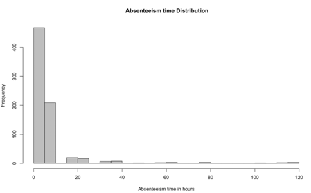

We found most people are absent for less than 10 hours each time. Next, we looked at the reasons for absenteeism. The graph on the left shows the total number of hours of absenteeism related to a specific reason, whereas the right shows the total number of times each absenteeism reason is reported. From the first graph, we see that reason 13, having musculoskeletal diseases, relates to the longest total hours in absence. In graph 2, however, we see that the most commonly reported reason is 23, making a blood donation. Since giving blood requires less recovery time than a musculoskeletal disease, we believe that that blood donations account for less of the total absence hours than musculoskeletal diseases.

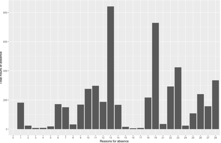  |  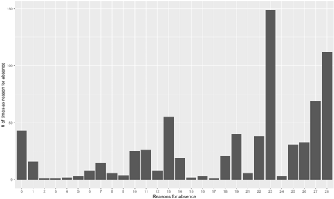
:--------------------------:|:-------------------------:

In terms of education, more than three fourth of employees who reported absenteeism have a high school education. As the level of education increases, fewer people report absenteeism. However, this does not mean that people who are less educated tend to be absent more often, because we do not have data about employees who do not report absenteeism.

  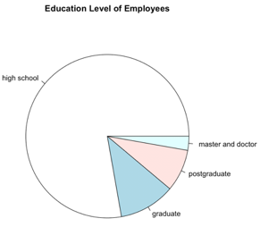

## Part 3. Data Preparation

We investigated all independent variables in detail and found that the dataset is relatively clean, and there’s no missing or wrong value in it. However, we found that some continuous variables should be categorical, such as "ID", "Reason.for.absence", "Month.of.absence", "Day.of.the.week", "Seasons", "Age", "Hit.target", "Disciplinary.failure", "Education", "Social.drinker" and "Social.smoker". Therefore, we converted these values to factor variables.

Secondly, we examined the correlation among all pairs of variables and noticed that the “Body.mass.index” is highly correlated with “Weight” (about 0.9). We decided to only include “Weight” in our model. Finally, we looked through the remaining data again to see if there’re any outliers but didn’t find any obvious one. And since the size of the dataset is not large, we decided not to remove anything and investigate them later after we explored our dataset in more detail.

## Part 4. Modeling and Evaluation

###### PCA

Having obtained a clean dataset, we can analyze the data. Before building models for absenteeism time, we first do unsupervised learning to investigate features of various clusters and to simplify the dataset. We only included continuous variables that work best in PCA. We found that PC1 (Service.time, Age, Weight, Transportation.expense) explains 31.4% of the total variance, and PC2 (Height and Distance.from.Residence.to.Work) explains 19% of the variance. We formed clusters with respect to absenteeism hours. We found the group with the highest absenteeism hours (lightest blue color) has higher service time, age, and weight. These groups will be informative for factors to include in our predictive model analysis.

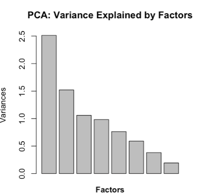  |  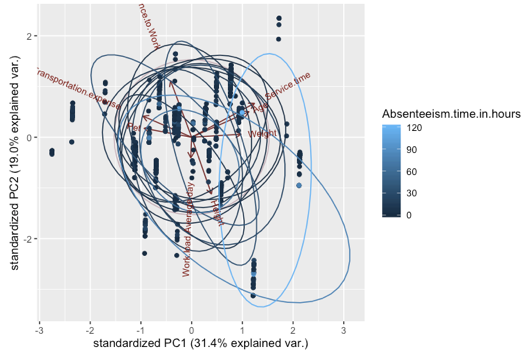
:--------------------------:|:-------------------------:

###### Hierarchical Clustering
We perform hierarchical clustering on the dataset using the complete linkage method. We visualize the hierarchical cluster data using a dendrogram plot by coloring the various clusters in the plot. The plot is as follows:

  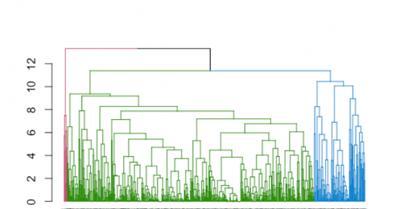

We can observe from the graph that most of the records of the data belong to one large cluster in green; there is a medium-sized cluster in blue, and a small group of records belong to the cluster in red. These employees in cluster 3 are outliers in the dataset.

On performing hierarchical clustering on the scaled data and aggregating the data, we get the statistics from the data. We can see that a small group (8 records) of older employees who have been a part of the company for a long time have a very high absentee time on average. Also, the distance to their residence is relatively lower than the other employees. These employees also have no disciplinary failures in the past and have a smaller workload relative to the other employees of the company. These employees have a higher number of children and have an education qualification only up to the graduate level.

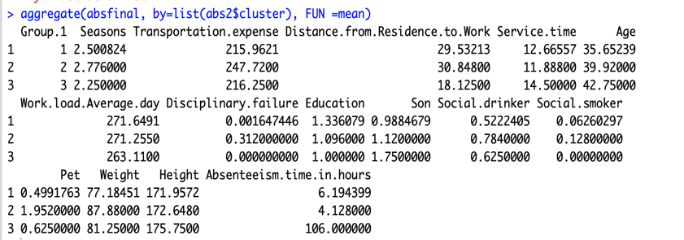  |  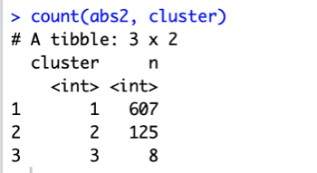
:--------------------------:|:-------------------------:

Therefore, with an increase in age, an increase in service time at the company, a decrease in the distance to the residence, a higher number of children, and less workload employee absentee time tends to increase. We can see that education shows a trend where the average absentee time reduces with a higher education level. However, a shift in the hiring standards may have occurred over time and now the companies hire more qualified people. Different hiring standards could imply that education has little or no impact on the absentee hours and that the identifiable trend can be attributed to the standard change.

###### K-means Clustering

Since K means clustering does not perform well with categorical data, we drop all the variables with categorical data and only consider the continuous variables for the analysis. Based on the output of the two graphs below, the optimal number of clusters for the dataset to perform k means clustering is 3.

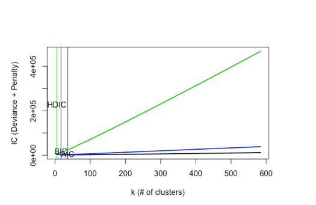  |  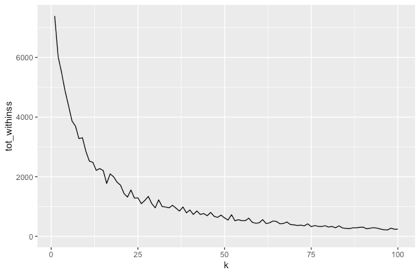
:--------------------------:|:-------------------------:

Selecting the number of centers to be three and performing k means clustering gives us the statistics, as shown in Table 4 of the appendix. We can see that the increase in age, reduction in transportation cost, a low distance of the company to the residence along with a high service time leads to more absence time in the office. Also, such employees have a higher number of children on average as compared to the remaining population. We can also see that the employees with the most absentee time have the highest workload at the company.

  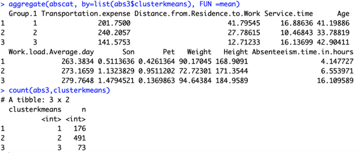

The plot for cluster categorization and a two-dimensional representation of the clusters is listed below:

  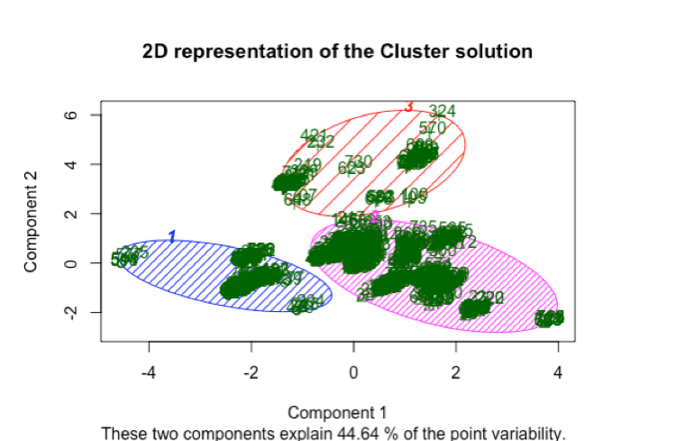

###### Predictive Modeling

As absenteeism is a continuous variable, we decided linear regression would be an excellent model to use. We first ran a linear regression with all the post-cleaning variables. Unfortunately, the majority of the variables were not significant, and the out of sample R squared were not satisfying. This result was surprising to us as we expected variables such as age or weight would have an impact on absenteeism, as we discovered previously via PCA. To further investigate, we ran stepwise and Lasso for this model. The out of sample R squared for stepwise was no better than that from the original model. The lowest R squared was -186.47. 

  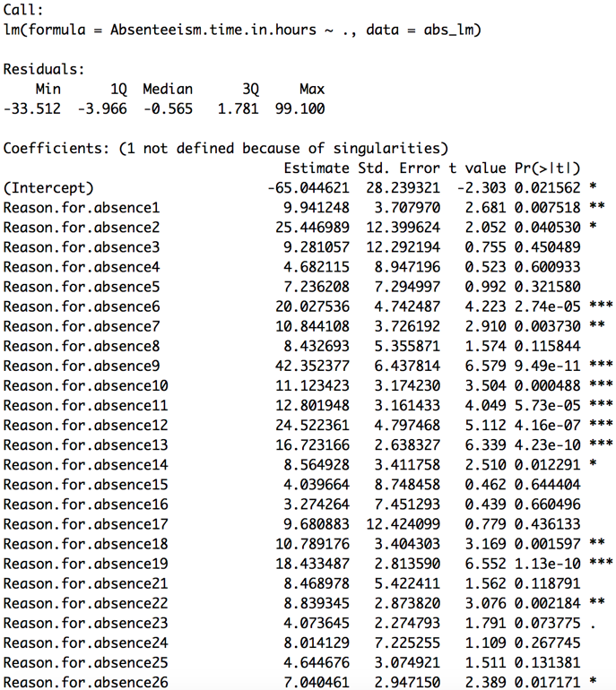

  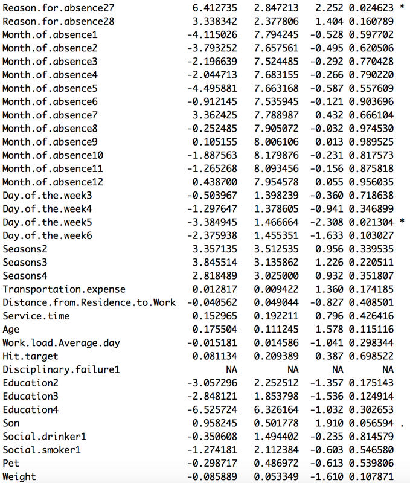

  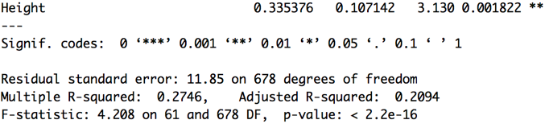

On the other hand, Lasso and Post Lasso models look much better. However, the models from the first standard error of the mean-squared error had 0 non-zero coefficient, which made it a null model. This coefficient was not helpful to our prediction. Therefore, only Lasso and Post Lasso models from the minimum of the mean-squared error were kept for further comparison.

Although we did not find any variables that have different effects on the relationship between any other variables and absenteeism, we decided to run a linear regression model with interaction. We want to ensure we did not fail to discover any pattern during data exploratory. On the other hand, we wanted to ensure our findings from data exploratory were correct. However, this model is not a suitable model in three ways. First, we had 2207 of variables in total and 678 coefficients, and thus, 1529 variables were utterly redundant. Secondly, none of the variables was significant at the 0.05 level. Lastly, the out of sample R squared of this model was terrible and it was as low as -1.80*10^5, which was much worse than the null model.

The model was not performing better after we ran stepwise selection and Lasso. Stepwise analysis returns 247 variables and the out of sample R squared is also as low as -1.64*10^4. For Lasso and Post Lasso, the models from the first standard error of the mean-squared error once again selected the null model. Therefore, we did not include these two models in our final comparison. We decided to only keep models from the minimum of the mean-squared error for further investigation.

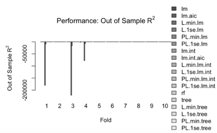  |  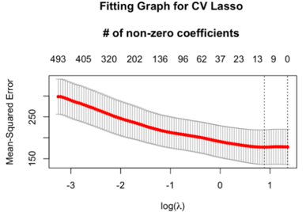
:--------------------------:|:-------------------------:

Since the classification tree is easier to understand, we decided to run a classification tree, a classification tree Lasso, and a classification tree Post Lasso. The classification tree was worse than the null model 80% of the times, and once again, models from the first standard error of the mean-squared error selected the null model. Therefore, we only kept models from the minimum of the mean-squared error for further analysis.

We also ran random forest to average the effect of different trees. Since random forest is less likely to overfit, we did not do Lasso and Post Lasso for it. We started at 500 trees. It was overfitting with 500 trees as error went up after at the 100th tree (see plot below). This discovery makes sense because we only have 740 data. Therefore, we reduce the number of trees to 100. The performance of the random forest was relatively good. Most of the time, the R squared was greater than one, and the highest was 43.57%.

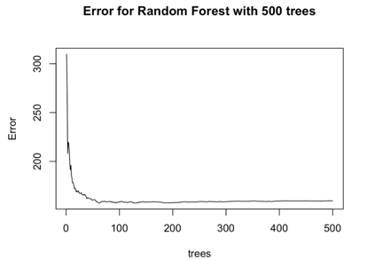  |  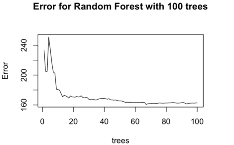
:--------------------------:|:-------------------------:

Now we have seven models left for comparison: random forest and Lasso and Post Lasso models for simple linear regression, simple linear regression with interaction, and classification tree. Random forest performed the best for 5 out of 10 times, had the highest mean, and the highest potential out of sample R squared. When we refitted using random forest, the R squared was 0.7316. Therefore, we decided random forest is the most useful model for this dataset.

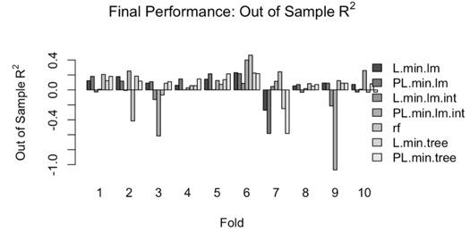  |  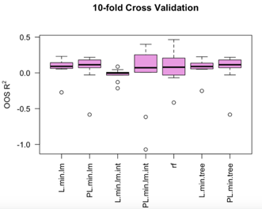
:--------------------------:|:-------------------------:

According to the random forest, “Reason for absence” is the most important feature. “Month of absence”, “Hit Target”, “Day of the week” and “Age” also have relatively significant effects. “Seasons”, “Transportation expense”, “Distance from Residence to Work”, “Weight”, “Height”, and “Service time” have a medium impact on the prediction. The rest of the variables do not have much influence on the prediction of absenteeism time.

  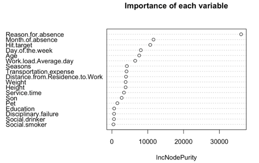

###### Causal Modeling

In addition to predictive modeling, we investigated a causal relationship for absence time. Since Age is statistically significant in all our predictive models, we choose to look at its causal inference on absence time. To isolate the effects of compounders, we used a double selection model. First, we used variables previously selected by Lasso and ran a regression of absence time on those variables except for Age. After getting fitted values, we predicted ages using factors that could affect it, such as service time, education, son, etc. Finally, we ran a regression of absenteeism time on Ages and predicted values from step 1 and step 2. We found Age is significant at 5% level and conclude that a one-year increase in Age would result in 0.19 hour more in absenteeism, holding everything else constant.

## Part 5. Deployment

We can draw useful insights for deployment from our analysis. First, we found age has a significant causal effect on absenteeism time, with older people having more absenteeism hours. A company should be prepared for older employees to miss more time than younger ones. Therefore, a company with many older employees can hire more younger people to achieve a balance between work time and experience.

Moreover, we found absence time also varies depending on time. Monday has the highest absenteeism reports and Thursday has the least. This discrepancy might result in unbalanced productivity within a week. As a recommendation, companies can make the process more transparent and allow employees to see when their peers are going to be absent. Employees can then make plans to take days off during times when more people will be working. In this way, the overall productivity is better balanced across days for the company.

## BIBLIOGRAPHY
1. https://www.cognoesis.com/absenteeism-at-work-analysisprediction/?fbclid=IwAR3VuMdSJM_rb8gNkRFXRM7xASNiBpGUnDoZ6R7sVrNxCj35Pv1QHjn8dO
A
2. https://www.datacamp.com
3. https://www.stackoverflow.com
4. UCI Machine Learning Repository
